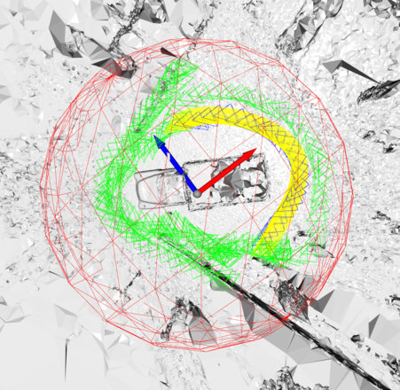

# NeRF++
Codebase for arXiv preprint ["NeRF++: Analyzing and Improving Neural Radiance Fields"](http://arxiv.org/abs/2010.07492)
* Work with 360 capture of large-scale unbounded scenes.
* Support multi-gpu training and inference with PyTorch DistributedDataParallel (DDP). 
* Optimize per-image autoexposure (**experimental feature**).

## Demo
 

## Data
* Download our preprocessed data from [tanks_and_temples](https://drive.google.com/file/d/11KRfN91W1AxAW6lOFs4EeYDbeoQZCi87/view?usp=sharing), [lf_data](https://drive.google.com/file/d/1gsjDjkbTh4GAR9fFqlIDZ__qR9NYTURQ/view?usp=sharing).
* Put the data in the sub-folder data/ of this code directory.
* Data format. 
    * Each scene consists of 3 splits: train/test/validation. 
    * Intrinsics and poses are stored as flattened 4x4 matrices (row-major).
    * Pixel coordinate of an image's upper-left corner is (column, row)=(0, 0), lower-right corner is (width-1, height-1).
    * Poses are camera-to-world, not world-to-camera transformations.
    * Opencv camera coordinate system is adopted, i.e., x--->right, y--->down, z--->scene. Similarly, intrinsic matrix also follows Opencv convention.
    * To convert camera poses between Opencv and Opengl conventions, the following code snippet can be used for both Opengl2Opencv and Opencv2Opengl.
      ```python
      import numpy as np
      def convert_pose(C2W):
          flip_yz = np.eye(4)
          flip_yz[1, 1] = -1
          flip_yz[2, 2] = -1
          C2W = np.matmul(C2W, flip_yz)
          return C2W
      ```
    * Scene normalization: move the average camera center to origin, and put all the camera centers inside the unit sphere.

## Create environment
```bash
conda env create --file environment.yml
conda activate nerfplusplus
```

## Training (Use all available GPUs by default)
```python
python ddp_train_nerf.py --config configs/tanks_and_temples/tat_training_truck.txt
```

## Testing (Use all available GPUs by default)
```python
python ddp_test_nerf.py --config configs/tanks_and_temples/tat_training_truck.txt \
                        --render_splits test,camera_path
```

**Note**: due to restriction imposed by torch.distributed.gather function, please make sure the number of pixels in each image is divisible by the number of GPUs if you render images parallelly. 

## Citation
Plese cite our work if you use the code.
```python
@article{kaizhang2020,
    author    = {Kai Zhang and Gernot Riegler and Noah Snavely and Vladlen Koltun},
    title     = {NeRF++: Analyzing and Improving Neural Radiance Fields},
    journal   = {arXiv:2010.07492},
    year      = {2020},
}
```

## Generate camera parameters (intrinsics and poses) with [COLMAP SfM](https://colmap.github.io/)
You can use the scripts inside `colmap_runner` to generate camera parameters from images with COLMAP SfM.
* Specify `img_dir` and `out_dir` in `colmap_runner/run_colmap.py`.
* Inside `colmap_runner/`, execute command `python run_colmap.py`.
* After program finishes, you would see the posed images in the folder `out_dir/posed_images`. 
    * Distortion-free images are inside `out_dir/posed_images/images`.
    * Raw COLMAP intrinsics and poses are stored as a json file `out_dir/posed_images/kai_cameras.json`.
    * Normalized cameras are stored in `out_dir/posed_images/kai_cameras_normalized.json`. See the **Scene normalization method** in the **Data** section.
    * Split distortion-free images and `kai_cameras_normalized.json` according to your need.

## Visualize cameras in 3D
Check `camera_visualizer/visualize_cameras.py` for visualizing cameras in 3D. It creates an interactive viewer for you to inspect whether your cameras have been normalized to be compatible with this codebase. Below is a screenshot of the viewer: green cameras are used for training, blue ones are for testing, while yellow ones denote a novel camera path to be synthesized.

<!--  -->


